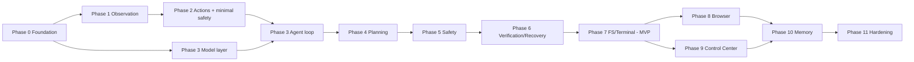

# local-control: Implementation Plan

> Executable roadmap derived from [MASTER_PLAN.md](./MASTER_PLAN.md) and [ARCHITECTURE.md](./ARCHITECTURE.md). A coding agent should execute the phases strictly in order. Each phase ends with a green test suite and a merge to `main`. Do not start a phase before the previous phase's *Definition of Done* is met.
>
> **Repository baseline:** empty (template README only). Phase 0 therefore creates the project from scratch.
>
> **Phase order adjustment vs. the original brief:** the kill switch and the `step` autonomy mode (approve every action) are built in **Phase 2**, before the first input action can be executed, instead of waiting for the full safety phase (Phase 5). No code path that sends input may exist without these two controls.

---

## Global Rules for Every Phase

1. Python 3.11+, `src/` layout, `pyproject.toml`, `uv` lockfile (pip-compatible). Verify every package name on PyPI before adding it.
2. Every boundary object is a Pydantic v2 model in `core/`. No untyped dicts crossing module boundaries.
3. Tests: `pytest`; markers `unit`, `integration`, `desktop` (needs interactive Windows session), `browser`, `e2e`. CI runs `unit` + `integration` on Linux; `desktop`/`browser`/`e2e` run locally on Windows.
4. Lint/format: `ruff` (lint + format), `mypy --strict` on `core/`, `safety/`, `models/`; `mypy` non-strict elsewhere.
5. Never add a dependency outside the stack table in MASTER_PLAN section 8.1 without recording the decision in `docs/DECISIONS.md` (create it in Phase 0).
6. Never implement a phase's "must NOT implement yet" items early, even if convenient.
7. Commit messages: `phase-N: <what>`.

---

## Phase 0 - Foundation

**Objective:** A runnable, testable, typed skeleton with configuration, logging, events, run persistence, the complete action vocabulary and core contracts. No OS interaction yet.

**Components to build:**

- Project scaffolding, CI, lint, type-check.
- `core/types.py`, `core/actions.py`, `core/events.py`, `core/errors.py`, `core/run_store.py`, `core/coordinates.py` (pure math only).
- `config/settings.py`, `config/default_config.toml`.
- `observability/logging.py`, `observability/audit.py`.
- `cli.py` with `doctor` (config + Python version checks only for now), `version`.

**Files that must exist after this phase:**

```text
pyproject.toml
.gitlab-ci.yml
.gitignore
README.md                       (replace template: purpose, safety warning, quick start)
config/default_config.toml
docs/DECISIONS.md
src/local_control/__init__.py
src/local_control/__main__.py
src/local_control/cli.py
src/local_control/config/__init__.py
src/local_control/config/settings.py
src/local_control/core/__init__.py
src/local_control/core/types.py
src/local_control/core/actions.py
src/local_control/core/events.py
src/local_control/core/errors.py
src/local_control/core/run_store.py
src/local_control/core/coordinates.py
src/local_control/observability/__init__.py
src/local_control/observability/logging.py
src/local_control/observability/audit.py
tests/conftest.py
tests/unit/core/test_actions_schema.py
tests/unit/core/test_events.py
tests/unit/core/test_run_store.py
tests/unit/core/test_coordinates.py
tests/unit/config/test_settings.py
```

**Dependencies:** `pydantic`, `pydantic-settings`, `structlog`, `typer`, `rich`, `pytest`, `pytest-asyncio`, `ruff`, `mypy`.

**Implementation order:** pyproject + CI -> settings -> errors -> actions (full union, including Phase 7/8 actions as types so the schema is stable; their tools come later) -> types -> events + EventBus -> run_store -> coordinates -> logging/audit -> CLI skeleton.

**Interfaces established:** `Action` union with JSON schema export (`Action.model_json_schema()`), `PlannerResponse`, `Observation`, `ActionResult`, `Verdict`, `VerificationResult`, `RecoveryDecision`, `TaskState`, `StepRecord`, `RunStatus`, `Event` + `EventBus.publish/subscribe`, `RunStore.create_run/append_event/write_state/load_run`, `CoordinateMapper.to_screen/to_image`, `Settings.load()`.

**Acceptance criteria:**

- `python -m local_control doctor` prints effective config with secrets masked.
- `Action` schema round-trips every action type (parametrized test over all types).
- Unknown action type is rejected with a Pydantic error.
- `RunStore` creates the run directory layout from ARCHITECTURE section 17 and reloads `events.jsonl` into typed events.
- CI green on GitLab shared Linux runners.

**Tests required:** schema round-trip for all actions; invalid action rejection; EventBus ordering and subscriber isolation; RunStore write/reload; CoordinateMapper scaling at 1.0/1.5/2.0 and clamping; settings precedence (defaults < file < env).

**Must NOT implement yet:** any `mss`/`pyautogui`/`pywinauto` import, model calls, prompts, validator logic (only the `Verdict` type).

**Definition of done:** all above tests pass in CI; `docs/DECISIONS.md` records stack decisions; README warns that the tool controls the computer and should be run as a standard user.

---

## Phase 1 - Basic Computer Observation

**Objective:** Produce a correct `Observation` on Windows: DPI-aware screenshot, window list, foreground window, cursor, screen state.

**Components to build:** `observation/screen.py` (DPI awareness init, `ScreenCapture` via `mss`), `observation/windows.py` (`WindowManager` via `pywinauto` uia + `pywin32`), `observation/image.py` (downscale rule from ARCHITECTURE section 7, PNG encode, perceptual hash, luminance check), `observation/observer.py`, `doctor` capture self-test, `cli observe` command (captures once, writes files, prints window table), test target app.

**Files:**

```text
src/local_control/observation/__init__.py
src/local_control/observation/screen.py
src/local_control/observation/windows.py
src/local_control/observation/image.py
src/local_control/observation/observer.py
tests/fixtures/target_app/app.py          (stdlib tkinter: fixed 800x600 window, titled "LC Test Target", buttons "Alpha" "Beta" "Delete", a text entry, a counter label, a password entry)
tests/unit/observation/test_image.py
tests/desktop/test_screen_capture.py
tests/desktop/test_window_manager.py
tests/desktop/test_observer.py
```

**Dependencies:** `mss`, `pillow`, `pywinauto`, `pywin32`, `imagehash` (or an in-house 64-bit dHash to avoid the dependency; decide and record).

**Implementation order:** DPI init (must be the first Windows call in process; place in `screen.init_dpi_awareness()` and call from CLI entry) -> ScreenCapture -> image utils -> WindowManager -> Observer -> `observe` command -> doctor self-test (draw nothing; instead verify `mss` monitor size equals `GetSystemMetrics(SM_CXSCREEN/SM_CYSCREEN)` after DPI init, and that cursor position from `GetCursorPos` maps into image bounds).

**Interfaces established:** `ScreenCapture.capture(monitor_index) -> RawFrame`, `WindowManager.list_windows() / foreground() / is_elevated(handle)`, `Observer.observe(last_result, step_index) -> Observation`, `screen_state` heuristics.

**Acceptance criteria:** at 100% and 150% DPI, `observe` produces an image whose dimensions match the physical screen scaled by the rule; the test target app appears in `windows` with a bbox that contains the button positions; `doctor` passes the DPI self-test; the black-frame heuristic flags an all-black test image.

**Tests required:** unit: downscale rule, phash distance on identical/slightly changed/different images, black-frame detection. desktop: capture dimensions, window listing includes target app, foreground detection after `set_focus`.

**Must NOT implement yet:** OCR, UIA tree, multi-monitor, any input.

**Definition of done:** `local-control observe` works on a Windows 11 machine at two DPI settings; unit tests in CI.

---

## Phase 2 - Basic Computer Actions (with minimal safety)

**Objective:** Execute the GUI action vocabulary safely and verifiably, with the kill switch and mandatory per-action approval in place before any input is sent.

**Components to build:** `safety/kill_switch.py` (`StopToken`, corner poller, global hotkey, stop file), `safety/approval.py` (`ApprovalGate` protocol + `CliApprovalGate`), `execution/tools/base.py`, `execution/tools/input_tool.py` (+ `PyAutoGuiBackend`, clipboard typing), `execution/tools/window_tool.py`, `execution/tools/wait_tool.py`, `execution/executor.py`, `cli act` (execute one action from JSON, always asks for approval, refuses if elevated).

**Files:**

```text
src/local_control/safety/__init__.py
src/local_control/safety/kill_switch.py
src/local_control/safety/approval.py
src/local_control/execution/__init__.py
src/local_control/execution/executor.py
src/local_control/execution/tools/__init__.py
src/local_control/execution/tools/base.py
src/local_control/execution/tools/input_tool.py
src/local_control/execution/tools/input_backend.py     (protocol + PyAutoGuiBackend)
src/local_control/execution/tools/window_tool.py
src/local_control/execution/tools/wait_tool.py
tests/unit/execution/test_executor.py                  (with a FakeTool)
tests/unit/safety/test_kill_switch.py                  (StopToken semantics, stop file)
tests/desktop/test_input_tool.py
tests/desktop/test_window_tool.py
```

**Dependencies:** `pyautogui`, `pynput` (hotkey), `pyperclip` or `pywin32` clipboard (choose pywin32 to avoid a dependency; record).

**Implementation order:** StopToken + KillSwitch -> Executor with FakeTool -> WaitTool -> WindowTool -> InputBackend -> InputTool -> `act` command with CliApprovalGate -> elevation check (`IsUserAnAdmin`) at CLI start.

**Interfaces established:** `Tool`, `ExecutionContext`, `InputBackend`, `Executor.execute(action, ctx) -> ActionResult`, `ApprovalGate.request/ask`, `StopToken.is_set/reason`.

**Acceptance criteria:** clicking the target app's "Alpha" button by image-space coordinates increments its counter; `type_text` with `"héllo wörld ✓"` lands in the entry exactly; `press_keys ["ctrl","a"]` selects entry text; `focus_window` postcondition passes; moving the mouse to a corner during a 10 s `wait` stops it within 300 ms with `STOPPED_BY_USER`; the hotkey does the same; the CLI refuses to start when elevated.

**Tests required:** unit: executor timeout and exception wrapping, StopToken checks between typed chunks. desktop: click/type/hotkey/scroll/drag against the target app, focus verification, kill switch corner and stop file.

**Must NOT implement yet:** policy tiers, model calls, the loop, `close_window` auto-approval (everything is approved manually in this phase).

**Definition of done:** all GUI actions verified against the target app on Windows; kill switch demonstrably works; no way to send input without passing `CliApprovalGate` in this phase.

---

## Phase 3 - Agent Loop (reactive)

**Objective:** First end-to-end autonomous behavior: goal in, observations to a vision model, typed proposals out, execution in `step` mode, full persistence and replay.

**Components to build:** `models/provider.py`, `models/openai_compat.py`, `models/fake.py`, `models/registry.py`; `agent/planner.py` (prompt builder, parser, retry), `agent/prompts/system_planner.md`, `agent/budget.py`, `agent/runner.py` (loop without Verifier/RecoveryPolicy: treat `assessment` as informational, stop on `done`/`fail`/budget), `TaskState` handling, `cli run`, `cli replay`.

**Files:**

```text
src/local_control/models/__init__.py
src/local_control/models/provider.py
src/local_control/models/openai_compat.py
src/local_control/models/fake.py
src/local_control/models/registry.py
src/local_control/agent/__init__.py
src/local_control/agent/planner.py
src/local_control/agent/budget.py
src/local_control/agent/runner.py
src/local_control/agent/prompts/system_planner.md
tests/unit/models/test_openai_compat.py          (httpx mock transport)
tests/unit/models/test_fake.py
tests/unit/agent/test_planner_parsing.py         (valid, fenced JSON, invalid -> retry, exhausted -> PlannerError)
tests/unit/agent/test_budget.py
tests/integration/agent/test_runner_fake.py      (FakeModelProvider + FakeComputer)
tests/integration/fakes/fake_computer.py         (in-memory Observer + Tools that mutate a virtual desktop)
```

**Dependencies:** `httpx`, `openai` (optional; prefer raw httpx to keep the adapter thin - decide and record).

**Implementation order:** provider protocol + fake -> openai_compat with JSON schema mode and plain-JSON fallback -> prompt builder -> parser with retry -> budget -> runner -> `run` (mode fixed to `step`) -> `replay`.

**Interfaces established:** `ModelProvider`, `ModelRequest/Response`, `Planner.propose(state, obs) -> PlannerResponse`, `AgentRunner.run(goal) -> RunResult`, `Budget.check(state) -> BudgetStatus`.

**Acceptance criteria:** with `FakeModelProvider` scripting three actions then `done`, the runner executes exactly three actions on `FakeComputer`, persists 4 observations and writes `summary.md`; with a real vision model, the goal "Click the Alpha button in the LC Test Target window" completes in `step` mode with user approvals; malformed model output is retried and logged; hitting `max_steps` ends with `FAILED_BUDGET`.

**Tests required:** as listed; plus an integration test that `feedback_queue` items (e.g., denied approval) appear in the next `ModelRequest` captured by the fake provider.

**Must NOT implement yet:** explicit `Plan` field handling (accept and ignore if present), verifier, recovery, policy tiers (`assisted`/`trusted` modes disabled), fs/shell tools.

**Definition of done:** a real model completes the target-app goal on Windows; integration suite green in CI.

---

## Phase 4 - Planning and Replanning

**Objective:** Explicit plans, step tracking, replanning on failure, history condensation.

**Components to build:** `Plan`/`PlanStep` handling in planner and state, replan prompt section, `history_full_steps` condensation, `summarizer` role (defaults to planner provider) for condensing old steps, plan rendering in CLI output.

**Files:** modifications to `agent/planner.py`, `agent/runner.py`, `core/types.py`, `agent/prompts/system_planner.md`; new `agent/history.py`; tests `tests/unit/agent/test_history.py`, `tests/integration/agent/test_replanning.py`.

**Implementation order:** Plan types -> prompt sections -> history condensation -> replan trigger on `assessment.previous_action_outcome == failure` twice on the same step -> CLI display.

**Acceptance criteria:** a scripted scenario where step 2 fails twice produces a `PlannerResponse` with `plan.revision == 1` and a changed step list; prompts stay under a configured token ceiling across a 40-step scripted run.

**Tests required:** history condensation determinism; replan trigger; plan validation (current_index in range, statuses consistent).

**Must NOT implement yet:** RecoveryPolicy ladder beyond the single replan trigger, stuck detection, verifier.

**Definition of done:** replanning demonstrated with fake provider and once with a real model on the target app (e.g., button renamed mid-run by the test harness).

---

## Phase 5 - Safety and Permissions

**Objective:** Full deterministic tiering, autonomy modes, per-run grants, audit log, rate limits.

**Components to build:** `safety/policy.py`, `safety/path_rules.py`, `safety/command_rules.py` (rules for fs/shell exist now even though tools arrive in Phase 7, because the action types already exist), `safety/validator.py`, `RunPermissions`, modes `step|assisted|trusted`, `approved_for_run` handling in `CliApprovalGate`, audit events, `cli policy explain <action.json>`.

**Files:**

```text
src/local_control/safety/policy.py
src/local_control/safety/path_rules.py
src/local_control/safety/command_rules.py
src/local_control/safety/validator.py
tests/unit/safety/test_policy_table.py           (table-driven: every action type x context -> expected tier)
tests/unit/safety/test_path_rules.py
tests/unit/safety/test_command_rules.py
tests/unit/safety/test_validator.py
tests/unit/safety/test_injection_corpus.py       (see TEST_PLAN)
tests/fixtures/policy_cases.yaml
tests/fixtures/injection_corpus.yaml
```

**Implementation order:** path_rules -> command_rules -> policy tables (BLOCKED first) -> validator (schema/bounds -> classify -> mode/grants -> rate limits) -> runner integration -> audit -> `policy explain`.

**Interfaces established:** `SafetyValidator.validate(action, obs, permissions, mode) -> Verdict`, `policy.classify`, `path_rules.resolve_and_classify`, `command_rules.classify`.

**Acceptance criteria:** every rule in SECURITY_MODEL section 5 has at least one test case; unmatched actions default to CONFIRM; BLOCKED cannot be granted; `trusted` grants persist only for the run; audit log contains all verdicts and approvals; rate limit stops after N destructive actions.

**Tests required:** as listed; property test that `classify` never returns SAFE for any action touching a protected zone.

**Must NOT implement yet:** fs/shell tool execution (validator rules yes, tools no), Control Center gate.

**Definition of done:** `assisted` becomes the default mode; policy table coverage report shows 100% of action types covered.

---

## Phase 6 - Verification and Recovery

**Objective:** The agent notices failures and reacts with a bounded ladder.

**Components to build:** `agent/verifier.py` (merge rules from ARCHITECTURE section 13), `agent/recovery.py`, `agent/stuck_detector.py`, `zoom_region` action support in Observer, goal check for `done`, optional `verifier` role + `system_verifier.md`, `OCRProvider` interface only (no adapter).

**Files:** `agent/verifier.py`, `agent/recovery.py`, `agent/stuck_detector.py`, `agent/prompts/system_verifier.md`, `observation/ocr.py` (protocol + `NullOCR`), tests `tests/unit/agent/test_verifier_merge.py`, `test_recovery_ladder.py`, `test_stuck_detector.py`, `tests/integration/agent/test_failure_recovery.py`.

**Implementation order:** deterministic postconditions in existing tools -> screen signals -> verifier merge -> stuck detector -> recovery ladder -> goal check -> `zoom_region` -> optional verifier role.

**Acceptance criteria:** scripted run where clicks change nothing -> `failure` via `no_visible_change` -> retry hint -> replan -> ask_user -> abort, in that order, with exact step counts; identical action three times triggers stuck; `done` with a failed last assessment is rejected; `zoom_region` attaches a full-resolution crop.

**Must NOT implement yet:** OCR adapter, UIA, memory.

**Definition of done:** recovery ladder covered by integration tests; real-model run on the target app recovers when the harness disables a button.

---

## Phase 7 - Filesystem and Terminal Tools (MVP completion)

**Objective:** Reliable, gated file and shell operations.

**Components to build:** `execution/tools/filesystem_tool.py` (send2trash, long paths, binary detection, caps), `execution/tools/terminal_tool.py` (shell detection, `-NoProfile -NonInteractive`, env stripping, timeout with tree kill, output files), postconditions, prompt guidance for preferring fs tools over GUI file manipulation.

**Files:** the two tools, `tests/unit/execution/test_filesystem_tool.py` (tmp_path), `tests/integration/execution/test_terminal_tool.py` (Windows only; allowlisted commands), `tests/e2e/test_scenario_organize_downloads.py`, `test_scenario_clone_diagnose.py`, `test_scenario_rename_categorize.py`.

**Dependencies:** `send2trash`.

**Acceptance criteria:** E2E scenarios 1, 3, 5 from TEST_PLAN pass in `assisted` mode with a real model on Windows; deleting sends to Recycle Bin and is CONFIRM; `shell_run "Get-ChildItem"` is SAFE; `shell_run "Remove-Item -Recurse"` is BLOCKED; a hanging command is killed at timeout.

**Must NOT implement yet:** browser, Control Center, memory.

**Definition of done:** MVP Definition in MASTER_PLAN satisfied; tag `v1.0.0-mvp`.

---

## Phase 8 - Browser Automation

**Objective:** DOM-level browser control through Playwright with a dedicated profile.

**Components to build:** `execution/tools/browser_tool.py`, `Observation.browser`, snapshot with refs, download handling, browser-specific policy rules (payment/credential/send patterns), prompt guidance.

**Files:** the tool, `tests/browser/fixtures/*.html` (form, list, fake checkout, login page), `tests/browser/test_browser_tool.py`, `tests/unit/safety/test_browser_policy.py`, `tests/e2e/test_scenario_research_report.py`, `test_scenario_web_workflow.py`.

**Dependencies:** `playwright` (+ `playwright install chromium` or `channel="msedge"`).

**Acceptance criteria:** scenarios 2 and 4 pass; clicking a button labelled "Pay now" on the fake checkout is BLOCKED; typing into `input[type=password]` is BLOCKED; stale refs produce `browser_stale_ref`; downloads land in the configured dir and are never executed.

**Must NOT implement yet:** Control Center, memory.

**Definition of done:** browser suite green locally; E2E 2 and 4 pass.

---

## Phase 9 - Control Center

**Objective:** Local web UI for goal entry, live status, approvals and stop.

**Components to build:** `control_center/server.py` (FastAPI, uvicorn, WebSocket `/ws`, REST `/runs`, `/runs/{id}/approve`, `/stop`, per-process token in URL), `ControlCenterApprovalGate`, JPEG preview publisher (2 fps while running), static `index.html/app.js/style.css` (panels: goal + plan, current step + reasoning status, action log, errors, screen preview, approve/deny, stop, run history with replay), `cli serve`.

**Files:** as above plus `tests/integration/control_center/test_ws_events.py`, `test_approval_roundtrip.py`.

**Dependencies:** `fastapi`, `uvicorn`, `websockets`.

**Acceptance criteria:** events appear in the UI within 200 ms; approvals from the UI unblock the runner; Stop sets the StopToken; server binds only to 127.0.0.1 and rejects requests without the token; replay of a past run renders its timeline and screenshots.

**Must NOT implement yet:** memory, multi-user, remote access.

**Definition of done:** a full scenario can be driven end to end from the Control Center without the CLI.

---

## Phase 10 - Memory and Workflows

**Objective:** Persist preferences and learned hints; record and replay successful workflows through the normal safety path.

**Components to build:** `memory/store.py` (SQLite schema from MASTER_PLAN section 20, migrations as numbered SQL files), `memory/workflows.py` (recorder, sanitizer that strips typed text and paths into parameters, replayer that seeds the plan), retriever, prompt section "Known hints", `cli remember`, `cli workflows list/run`.

**Files:** as above, `tests/unit/memory/test_store.py`, `test_workflow_recorder.py`, `tests/integration/memory/test_hint_injection.py`.

**Acceptance criteria:** a completed run creates a workflow; replay reproduces the plan with parameters and still asks for CONFIRM actions; hints appear in prompts capped at 500 tokens; memory never contains secrets (sanitizer test).

**Must NOT implement yet:** embeddings/vector search, cross-machine sync.

**Definition of done:** scenario 1 replay via workflow succeeds faster (fewer steps) than the original run in a test.

---

## Phase 11 - Hardening

**Objective:** Robustness and accuracy improvements identified during V1/V2.

**Components to build (each independently mergeable):** `SendInputBackend`; multi-monitor observation/actions (virtual screen coordinates, monitor selection); `observation/uia.py` + Set-of-Marks annotation + `ref` targeting; RapidOCR adapter; role-specific models; cost optimizations (image detail levels, cached window lists); `doctor` extensions (antivirus/hotkey registration checks); import-linter enforcement of module boundaries; security review checklist execution.

**Acceptance criteria:** per item, with desktop tests; all E2E scenarios still pass; misclick rate on a small-target benchmark (tests/desktop/benchmark_small_targets.py) improves with Set-of-Marks enabled.

**Definition of done:** V4 items from MASTER_PLAN remain future; everything else in this list merged.

---

## Cross-Phase Dependency Map



## Implementation Blockers and Prerequisites

| Blocker | Needed by | Resolution |
|---------|-----------|------------|
| A Windows 10/11 machine with an interactive session for desktop tests | Phase 1 | Developer machine or VM; not GitLab shared runners. |
| A vision-capable model endpoint and API key | Phase 3 acceptance | User decision; any OpenAI-compatible vision endpoint works. Fake provider unblocks all CI tests. |
| Decision: `imagehash` dependency vs in-house dHash | Phase 1 | Recommend in-house 64-bit dHash (20 lines, no numpy requirement). Record in DECISIONS.md. |
| Decision: `openai` SDK vs raw `httpx` | Phase 3 | Recommend raw `httpx`; the OpenAI-compatible surface used is small (chat completions with image parts and `response_format`). |
| Playwright browser binaries (~150 MB) | Phase 8 | `playwright install chromium` or use `channel="msedge"` if Edge is installed. |
| Global hotkey registration may fail under some EDR | Phase 2 | `doctor` reports; corner failsafe and stop file remain. |

## What "Done" Means for the Whole Plan

All 12 phases merged; every E2E scenario in TEST_PLAN passes on a clean Windows 11 VM in `assisted` mode; the security review checklist in SECURITY_MODEL is signed off; no open P1 issues.
